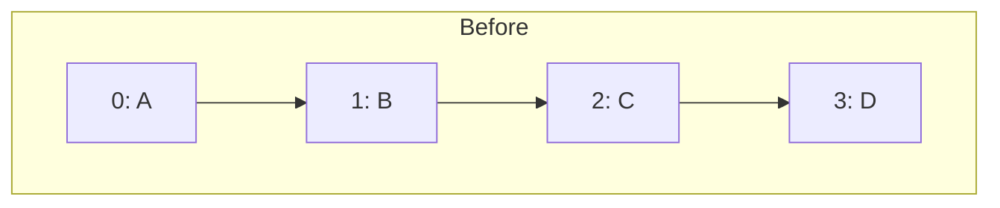
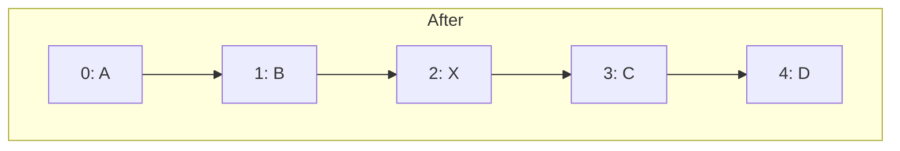
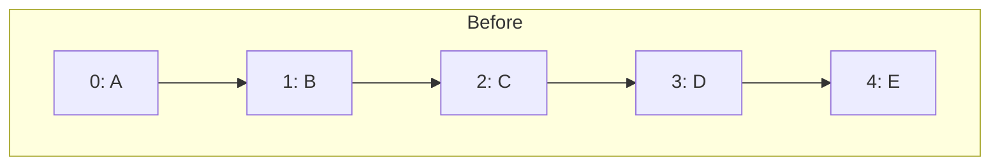
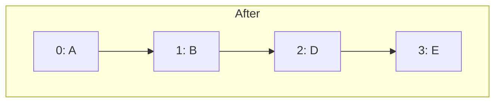

- 선형적인 자료구조 
- 데이터를 일렬로 늘여 놓은 형태
- 순서
#### 데이터 삽입하기



데이터가 있는 위치에서 가장자리 삽입하지만 데이터를 중간에 삽입 할수도 있다.
중간부터 삽입한 경우 인덱스의 위치로부터 데이터가 위치한 제일 뒤에 인덱스까지 모두 한 칸씩 뒤로 데이터를 밀어주는 작업을 먼저 해야함. 기존 `2`에 있던 데이터 `C-> 3 ` , `D-> 4` 
이게 뒤에 데이터가 1개라면 데이터를 옮겨주는 연산을 1번 하면 되겠지만 이렇게 데이터가 2개인 경우 2번해야함. N개라면 N번이기 때문에  <span style="background:#d4b106">시간 복잡도는 O(N)번이다.</span>
#### 데이터 삭제하기





 해당 인덱스 위치 데이터가 삭제되면 텅 빈 상태가 되기때문에 뒤에 데이터들이 앞으로 당겨오는 작업을 함. 인덱스 위치로부터 뒤에 있는 데이터가 많으면 많을수록 <span style="background:#d4b106"> 시간복잡도 O(N)를 갖는다.</span>
#### 데이터 탐색하기
- 탐색 by Index

랜덤 액세스(배열이나 리스트에서 특정 위치에 바로 다이렉트로 접근할수 있는 능력, 배열은 연속된 메모리 공간에 저장되기때문에)로 해당 위치에 즉시 접근해서 값을 꺼낼수 있다.
<span style="background:#d4b106">시간복잡도 O(1)</span>
### ArrayList
- 배열 기반의 리스트
- 메모리 공간을 연속적으로 사용

```java title=IList
package list;  
  
public interface IList <T> {  
    void add(T t);  
  
    void insert(int index, T t);  
  
    void clear();  
  
    boolean delete(T t);  
  
    boolean deleteByIndex(int index);  
  
    T get(int index);  
  
    int indexOf(T t);  
  
    boolean isEmpty();  
      
    boolean contains(T t);  
  
    int size();  
}
```

```java title=MyArrayList
package list;  
  
import java.util.Arrays;  
  
public class MyArrayList<T> implements IList<T>{  
  
    private static final int DEFAULT_SIZE = 50;  
    private int size;  
    private T[] elements;  
  
    public MyArrayList(int size) {  
        this.size = 0;  
        this.elements =(T[]) new Object[DEFAULT_SIZE];  
    }  
  
    @Override  
    public void add(T t) {  
        //element 배열이 꽉 찬 경우가 있을수 있음  
        if (this.size == this.elements.length) {  
            this.elements = Arrays.copyOf(this.elements, this.size * 2);  
        }  
        this.elements[this.size ++] = t;  
    }  
  
    @Override  
    public void insert(int index, Object o) {  
        if (this.size == this.elements.length) {  
            this.elements = Arrays.copyOf(this.elements, this.size * 2);  
        }  
        for (int i = index; i < this.size; i++) {  
            this.elements[i+1] = this.elements[i];  
        }  
        this.elements[index] = t;  
        this.size++;  
    }  
  
    @Override  
    public boolean delete(T t) {  
        for (int i = 0; i < this.size; i++) {  
            if (this.elements[i].equals()) {  
                for (int j = i; j < this.size - 1; j++) {  
                    this.elements[j] = this.elements[j + 1];  
                }  
                this.size--;  
                return true;  
            }  
        }  
        return false;  
    }  
  
    @Override  
    public boolean deleteByIndex(int index) {  
        if (index < 0 || index >= this.size) {  
            return false;  
        }  
        for (int i = index; i < this.size - 1; i++) {  
            this.elements[i] = this.elements[i + 1];  
        }  
        this.size--;  
        return true;  
    }  
  
    @Override  
    public T get(int index) {  
        if (index < 0 || index >= this.size) {  
            throw new IndexOutOfBoundsException();  
        }  
  
        return this.elements[index];  
    }  
  
    @Override  
    public int indexOf(T t) {  
        for (int i = 0; i < this.size; i++) {  
            if (this.elements[i].equals(t)) {  
                return i;  
            }  
        }  
        return -1;  
    }  
    @Override  
    public boolean contains(T t) {  
        for (int i = 0; i < this.size; i++) {  
            if (this.elements[i].equals(t)) {  
                    return true;  
            }  
        }  
        return false;  
    }  
  
    @Override  
    public boolean isEmpty() {  
        return this.size ==0;  
    }  
  
    @Override  
    public int size() {  
        return this.size;  
    }  
  
    @Override  
    public void clear() {  
      this.size = 0 ;  
        this.elements =(T[]) new Object[DEFAULT_SIZE];  
    }  
}
```